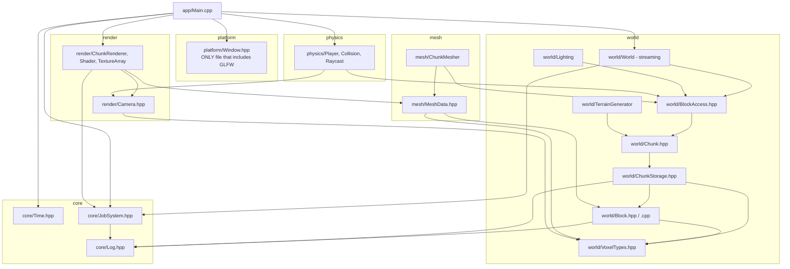
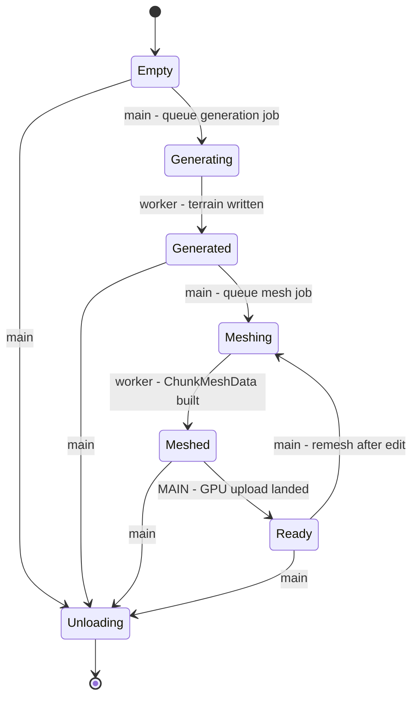

# Voxl - Technical Design

A first-person voxel sandbox engine. C++20, OpenGL 4.5 core, Windows/MSVC.

This document is the reference for the frozen contracts every module compiles
against. Where it disagrees with the headers, the headers win - but that is a
bug, and the fix is to update this file in the same commit.

---

## 1. Coordinate conventions

Defined in `src/world/VoxelTypes.hpp`.

| Concept | Type | Notes |
|---|---|---|
| Voxel in world space | `BlockPos {int32 x, y, z}` | unbounded horizontally |
| Chunk on the chunk grid | `ChunkPos {int32 x, y, z}` | `y` in `[0, kWorldSectionCount)` |
| Vertical column | `ColumnPos {int32 x, z}` | unit of streaming and persistence |

* `kChunkSize = 32`, `kChunkVolume = 32768`, `kChunkSizeLog2 = 5`.
* `kWorldSectionCount = 8`, so the world is 256 blocks tall: `kWorldMinY = 0`,
  `kWorldMaxY = 255`. `kSeaLevel = 96`.
* Block -> chunk uses an **arithmetic right shift**, not division. `/` truncates
  toward zero and would fold chunk -0 and +0 together, tearing the world along
  every negative axis.
* **Linear voxel index (contract):** `localIndex(x, y, z) = (y * 32 + z) * 32 + x`.
  **x varies fastest, then z, then y.** Meshing, lighting and the save format all
  sweep in this order. Never re-derive it.
* `Direction` is `NegX=0, PosX=1, NegY=2, PosY=3, NegZ=4, PosZ=5`. The `+/-` pairs
  are adjacent so `opposite()` is `value ^ 1`. These numbers are baked into packed
  mesh vertices and must never be renumbered.

### Render-space conventions

Defined in `src/render/Camera.hpp`.

* **Right-handed.** `+X` east, `+Y` up, `+Z` south. Forward at zero rotation is `-Z`.
* Clip space is OpenGL's `z ∈ [-1, 1]`. GLM is **not** built with
  `GLM_FORCE_DEPTH_ZERO_TO_ONE`; the frustum extraction depends on this.
* Angles are **degrees** in the public API.
* Yaw rotates about `+Y`: yaw 0 looks down `-Z`, yaw `+90` looks down `-X`
  (increasing yaw turns left). Pitch is positive looking up, clamped to `±89°`.
* Matrices come from `glm::lookAtRH` and `glm::perspectiveRH_NO`.

---

## 2. Module dependency graph

Arrows point from dependant to dependency. There are no cycles; anything that
would introduce one is a design error.



Rules enforced by review:

* Only `src/platform/` may include `<GLFW/glfw3.h>`.
* `<glad/gl.h>` must be included before any GL usage.
* `world/` never includes `render/` or `mesh/`. The mesher reads the world
  through `BlockAccess`, not the other way round.
* Nothing outside `render/` calls a `gl*` function.

---

## 3. Threading model

### 3.1 Threads

| Thread | Owns |
|---|---|
| Main | GLFW window, the GL context, the chunk map's writer side, ImGui, input, the frame loop |
| Workers (`hardware_concurrency() - 1`, min 1) | Terrain generation, meshing, lighting propagation, chunk I/O |

`src/core/JobSystem.hpp` provides the pool: per-worker deques with stealing,
three priorities (`High`, `Normal`, `Low`), drained strictly in that order.

### 3.2 The one absolute rule

> **OpenGL calls are FORBIDDEN on worker threads.**

The context is current on the main thread only. A worker produces CPU-side data
(a `ChunkMeshData`, a decoded image) and posts a closure to
`JobSystem::mainThreadQueue()`. The frame loop calls
`mainThreadQueue().drain(budget)` exactly once per frame with a time budget
(2 ms is the starting value), so a burst of freshly meshed chunks cannot blow
frame time. The budget is checked *after* each closure, so at least one upload
always makes progress.

### 3.3 Frame loop shape

```
window.pollEvents();
clock.tick();
input.update();
while (clock.nextFixedStep()) { physics.step(clock.fixedDeltaSeconds()); }
world.update(camera);                      // schedules generation/mesh jobs
jobs.mainThreadQueue().drain(2ms);         // the ONLY place GPU uploads happen
renderer.render(camera, clock.fixedAlpha());
debugOverlay.draw(jobs.stats(), clock, world.memoryStats());
window.swapBuffers();
```

### 3.4 Why meshing takes a snapshot instead of locking the world

Meshing one chunk reads a 34³ region: all of the centre chunk plus a one-block
skirt from its neighbours (a full 3×3×3, not just the 6 faces, because smooth
ambient occlusion samples the diagonals). That is tens of thousands of reads and
takes milliseconds.

Holding the world's chunk-map lock for that duration would make the map the
single serialising resource in the engine: the main thread could not insert a
newly streamed chunk, and every other mesher would block. Hitches would grow
with view distance.

Instead the main thread does one short critical section - look up 27 entries and
copy their `shared_ptr`s into a `ChunkNeighbourhood` (`src/world/BlockAccess.hpp`)
- and hands that value type to a worker. After that the worker touches no shared
mutable state:

* the `shared_ptr`s keep the chunks alive even if streaming decides to unload
  them mid-mesh, so there is no use-after-free;
* the chunks are in state `Meshing`/`Ready`, where the threading contract forbids
  writes, so the reads are race-free without atomics;
* a concurrent player edit bumps `Chunk::contentVersion()`; the main thread
  compares it before uploading and discards the stale mesh.

Cost: 27 atomic refcount increments per mesh job, against a millisecond of
protected work.

### 3.5 Out-of-world and missing-chunk reads

Never undefined. From `src/world/BlockAccess.hpp`:

| Query | Block | Packed light |
|---|---|---|
| `y > kWorldMaxY` | `blocks::Air` | sunlight 15, block light 0 |
| `y < kWorldMinY` | `blocks::Bedrock` | 0 |
| Neighbour chunk not resident | `blocks::Air` | sunlight 15, block light 0 |

Air above rather than an opaque block, because an opaque sky would cull the top
face of every surface block at `y == kWorldMaxY`. Bedrock below, so the bottom
layer's downward faces are culled. Air for a missing neighbour, because treating
it as opaque bakes permanent holes into the seam - a mesh is only rebuilt when
something dirties it. The scheduler should still refuse to mesh an incomplete
neighbourhood; see `ChunkNeighbourhood::complete()`.

### 3.6 Determinism

Same seed, same world. No `rand()`, no unseeded RNG, no reliance on job
completion order for world content. Terrain generation for a chunk must be a
pure function of `(seed, ChunkPos)` so that the order in which the pool happens
to schedule chunks cannot change the result.

---

## 4. Chunk lifecycle state machine

`ChunkState` in `src/world/Chunk.hpp`. The state is a `std::atomic` and every
transition goes through `tryTransition(expected, next)`, a CAS. Duplicate or
conflicting transitions - two schedulers both deciding to remesh the same chunk
- are the classic bug here, and the CAS is what makes exactly one of them win.



`isLegalChunkTransition(from, to)` is the single constexpr source of truth and is
asserted on every `tryTransition`.

`Unloading` is deliberately **not** reachable from `Generating` or `Meshing`. A
worker holds a `shared_ptr` and is mid-flight in those states; the unload path
waits for the job to publish its result and only then retires the chunk.

### Threading contract per method

**Main thread only:** construction/destruction, `setBlock`, `setLight` outside
generation, `markDirty`, `clearRemeshFlag`, `markSaved`, `setMeshedVersion`, and
every transition into `Meshing` or `Unloading`.

**Workers may:**
* write voxels/light while the state is `Generating` **and** they are the worker
  that performed `Empty -> Generating` (exclusive ownership by construction);
* read voxels/light while the state is `Meshing` or `Ready`, holding a
  `shared_ptr`;
* call `state()`, `tryTransition()`, `contentVersion()`, `position()`, the memory
  accessors and the dirty-flag readers at any time.

**Never from a worker:** `setBlock` on a `Ready` chunk, any GL call, or
transitioning a chunk it does not own.

`Chunk` is **pinned** - non-copyable and non-movable. It holds `std::atomic`
members (not movable), and workers compare captured neighbours by address, so it
must never relocate. Always heap-allocate via `Chunk::create()`.

### Dirty flags

* `needsRemesh()` - voxels or light changed since the last mesh.
* `needsSave()` - diverges from disk.
* `contentVersion()` - monotonic, bumped by every voxel write. A mesh job records
  it; the main thread compares before uploading and drops stale results.
  Without this, an edit made while a mesh job is in flight is silently reverted
  on screen until something else dirties the chunk.

---

## 5. Chunk storage

`src/world/ChunkStorage.hpp`. **Not thread safe by design** - the owning `Chunk`
provides all synchronisation.

Three representations:

1. **Uniform** (`bitsPerIndex() == 0`) - the whole section is one block id in a
   single field, zero heap allocation. This is most sections in a real world
   (empty sky, solid stone) and gets its own case rather than a 1-bit palette:
   8 bytes instead of 4 KB, and `get()` is a load with no shift.
2. **Paletted** - `std::vector<BlockId>` palette plus indices packed into 64-bit
   words at 1, 2, 4, 8 or 16 bits each.
3. At 16 bits the palette addresses every `BlockId` that exists, so there is no
   wider representation to grow into.

**Growth and repack rule.** `bitsPerIndex` only increases, through
`0 -> 1 -> 2 -> 4 -> 8 -> 16`. Writing an id not yet in the palette appends it;
if the palette is already full for the current width (`2^bits` entries) the index
array is repacked to the next width first. Repacking is `O(kChunkVolume)` but
happens at most four times in a section's life. Widths are restricted to divisors
of 64 so no packed index straddles a word boundary: `get`/`set` are one
load/store with two shifts and no branch.

The palette is **not** reference counted - that would double the cost of the
generation inner loop. `optimise()` does a single `O(volume)` sweep after
generation or after an edit burst, drops unused entries, shrinks the width and
collapses back to uniform when only one id remains.

**Light** is stored separately, one byte per voxel, so lighting updates never
touch the palette: **high nibble sunlight, low nibble block light**
(`kSunlightShift = 4`, `kBlockLightShift = 0`, both `0..15`). It has its own
uniform fast path (`fillLight`) so an all-air sky section is one byte.

`memoryUsageBytes()` reports the full footprint for the debug overlay.

---

## 6. Vertex format

`src/mesh/MeshData.hpp`. **8 bytes per vertex, two `uint32` integer attributes**,
uploaded with `glVertexAttribIPointer` (integer attributes, *not* normalised
floats). `kVertexFormatVersion` is bumped whenever this changes.

### `data0` - attribute location 0

| Bits | Field | Width | Range |
|---|---|---|---|
| 0-5 | `posX` | 6 | 0..32 inclusive |
| 6-11 | `posY` | 6 | 0..32 inclusive |
| 12-17 | `posZ` | 6 | 0..32 inclusive |
| 18-20 | `direction` | 3 | `voxl::Direction`, 0..5 |
| 21-24 | `sunlight` | 4 | 0..15 |
| 25-28 | `blockLight` | 4 | 0..15 |
| 29-30 | `ao` | 2 | 0 = fully occluded .. 3 = open |
| 31 | reserved | 1 | must be 0 |

### `data1` - attribute location 1

| Bits | Field | Width | Range |
|---|---|---|---|
| 0-11 | `textureLayer` | 12 | 0..4095, layer in the block texture array |
| 12-16 | `width - 1` | 5 | quad extent along U, 1..32 |
| 17-21 | `height - 1` | 5 | quad extent along V, 1..32 |
| 22-23 | `corner` | 2 | `QuadCorner`: 0 origin, 1 +U, 2 +U+V, 3 +V |
| 24-31 | reserved | 8 | must be 0 |

Positions need **6 bits, not 5**: a greedy quad's far corner sits on the chunk
boundary at coordinate 32, so 33 distinct values are required. Positions are
chunk-local; the shader adds the chunk origin from a uniform. Keeping them 6-bit
integers rather than floats is what buys the 8-byte vertex - a large view
distance costs ~100 MB of VBO instead of ~400 MB, and the visible set stays in
the GPU's cache hierarchy.

The GLSL side must match exactly:

```glsl
layout(location = 0) in uint aData0;
layout(location = 1) in uint aData1;

vec3  pos        = vec3(aData0 & 63u, (aData0 >> 6) & 63u, (aData0 >> 12) & 63u);
uint  dir        = (aData0 >> 18) & 7u;
float sun        = float((aData0 >> 21) & 15u) / 15.0;
float blockLight = float((aData0 >> 25) & 15u) / 15.0;
float ao         = float((aData0 >> 29) & 3u)  / 3.0;
uint  layer      = aData1 & 4095u;
vec2  size       = vec2(((aData1 >> 12) & 31u) + 1u, ((aData1 >> 17) & 31u) + 1u);
uint  corner     = (aData1 >> 22) & 3u;
vec2  uv         = size * vec2(float(corner == 1u || corner == 2u),
                               float(corner == 2u || corner == 3u));
```

A mismatch between the two sides is invisible until the geometry is garbage, so
change both in the same commit.

### Mesh containers

`MeshLayerData` holds one `RenderLayer`'s vertices and 32-bit indices.
`ChunkMeshData` holds one per layer (`Opaque`, `Cutout`, `Translucent`), the
`ChunkPos`, the `contentVersion` it was built from, and tight local bounds for
culling. `triangleCount()` and `byteSize()` feed the debug overlay.

`MeshLayerData::addQuad` is the only place winding is decided: it emits corners
0-3 counter-clockwise as seen from outside the face and picks the split diagonal
from the corner AO values, which removes the classic diagonal seam artefact.

---

## 7. Block registry

`src/world/Block.hpp` (frozen) and `src/world/Block.cpp`.

`createDefaultBlockRegistry()` registers all 18 ids in `namespace blocks` and
calls `finalise()`. After `finalise()` the registry is immutable and readable
from any thread without synchronisation - that is the only reason worker threads
may query it freely.

Ids are written to disk. Never renumber; append and bump the world format
version. An unregistered id resolves to air, which is the graceful degradation
path for a save file written by a newer build.

### Texture array layer order (contract)

The renderer builds a `GL_TEXTURE_2D_ARRAY` whose layer *N* is the image below.
This order is written into every packed vertex, so inserting a layer in the
middle silently retextures the world. **Append only.** Source of truth:
`enum TextureLayer` at the top of `src/world/Block.cpp`.

| Layer | Name | Layer | Name |
|---|---|---|---|
| 0 | `stone` | 11 | `glass` |
| 1 | `dirt` | 12 | `snow` |
| 2 | `grass_top` | 13 | `sandstone_top` |
| 3 | `grass_side` | 14 | `sandstone_side` |
| 4 | `sand` | 15 | `sandstone_bottom` |
| 5 | `gravel` | 16 | `cobblestone` |
| 6 | `water` | 17 | `bedrock` |
| 7 | `log_top` | 18 | `glowstone` |
| 8 | `log_side` | 19 | `clay` |
| 9 | `leaves` | 20 | `ice` |
| 10 | `planks` | | |

Files resolve to `assets/textures/blocks/<name>.png`. 21 layers total.

### Notable block properties

| Block | Layer | Collision | Opaque | Attenuation | Emission | Hardness |
|---|---|---|---|---|---|---|
| Air | - | None | no | 0 | 0 | 0 (replaceable) |
| Water | Translucent | Fluid | no | 2 | 0 | 0 |
| Leaves | Cutout | Cube | no | 1 | 0 | 0.2 |
| Glass | Translucent | Cube | no | 0 | 0 | 0.3 |
| Ice | Translucent | Cube | no | 1 | 0 | 0.5 |
| Glowstone | Opaque | Cube | yes | - | **15** | 0.3 |
| Bedrock | Opaque | Cube | yes | - | 0 | **-1 (unbreakable)** |

`hardness < 0` is the agreed sentinel for unbreakable; interaction code must test
it before computing a break time.

`replaceable` is true **only for air**, per the frozen header's contract. The
interaction raycast must additionally skip blocks whose `liquid` flag is set, so
the player can place a block into water rather than selecting the water itself.

`BlockRegistry::facesHidden(block, neighbour)` is the single rule governing
hidden-face removal; the mesher must not reimplement it.

---

## 8. Timing and profiling

`src/core/Time.hpp`.

* `FrameClock::tick()` once per frame. `deltaSeconds()` is clamped to 250 ms and
  scaled by `timeScale`; `rawDeltaSeconds()` is unclamped, for diagnostics only.
  A multi-second delta from a window drag or a breakpoint would otherwise
  teleport the player through the world.
* Fixed timestep defaults to 60 Hz. Drive it with
  `while (clock.nextFixedStep()) { ... }` and interpolate the render with
  `fixedAlpha()`. At most 5 catch-up steps per frame: past that the accumulator
  is dropped rather than entering the death spiral where each frame is slower
  than the physics it must catch up on.
* `VOXL_TIME_SCOPE(sample)` wraps a scope into a `TimingSample` (last, smoothed,
  min, max in ms). CPU wall time only - GPU work is asynchronous, so timing a
  draw call measures submission, not execution. Use GL timer queries for that.

---

## 9. Debug overlay data sources

| Panel | Source |
|---|---|
| FPS / frame ms | `FrameClock::fps()`, `smoothedFrameMs()` |
| Job queue depth | `JobSystem::stats()` -> queued / active / outstanding / mainThreadPending |
| Chunk states | histogram of `Chunk::state()` over the resident set |
| Voxel memory | sum of `Chunk::memoryUsageBytes()` |
| GPU mesh memory | sum of `ChunkMeshData::byteSize()` over uploaded chunks |
| Triangles drawn | renderer's per-frame counter, `ChunkMeshData::triangleCount()` |
| Section subsystem timings | `TimingSample` per subsystem |

---

## 10. Persistence outline

Not yet implemented; the contracts above already fix its shape.

* Unit of storage is the `ColumnPos` - a whole vertical column, loaded and saved
  together.
* A section serialises as: state byte, `bitsPerIndex`, palette length, palette
  (`uint16` each), packed index words (`uint64` each, little-endian), then the
  light bytes. Uniform sections write the single id and no index array.
* Voxel order inside a section is `localIndex` order (x fastest, then z, then y).
* The format carries a version; block-id remapping on upgrade is by name via
  `BlockRegistry::findByName`.
